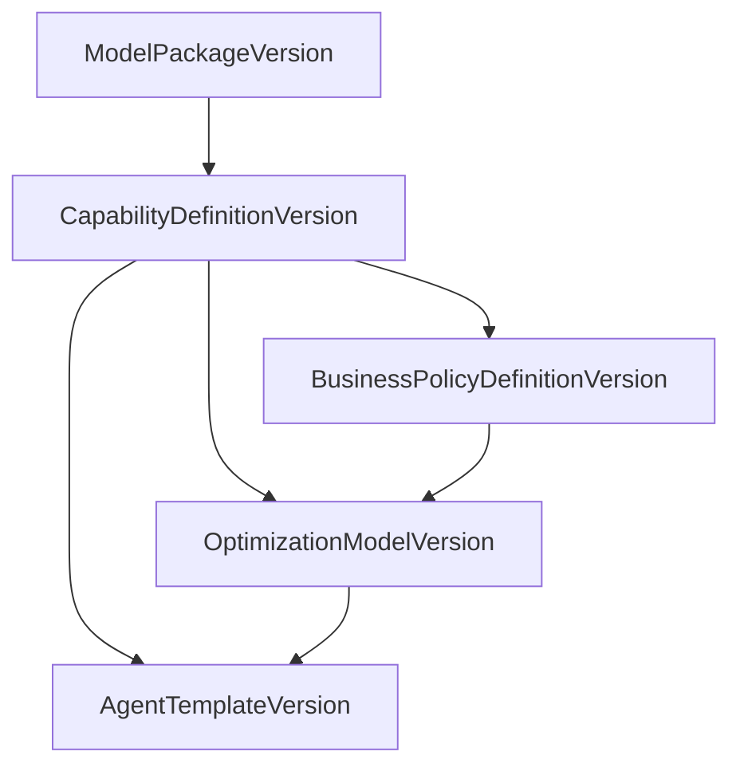

# Domain Packages

EnterpriseThreadOS separates an **industry-neutral platform core** from **domain packages** that carry ontology content, import/query behavior, and governed artifact seeds for a specific industry demo or tenant rollout.

## Core versus package boundary

| Platform core (`ETOS.Backend`) | Domain package (`packages/*`) |
| --- | --- |
| Generic parsers (`ModelPackageProfileParser`), resolvers, import staging engine | Manufacturing object types, BOM metadata, CAD/EBOM comparison profiles |
| Capability / business policy / optimization / agent-template artifact modules | Published seed definitions for those artifacts |
| Reference package installer orchestration | JSON manifest, ontology fragments, demo CSV fixtures |
| Development-only install endpoint | Package README and versioned content |

The core must not hardcode manufacturing strings in hot paths. Manufacturing demo semantics live in [`packages/manufacturing-reference/`](../packages/manufacturing-reference/).

## Ontology-as-brain

The model package is the brain for imports, staging, governed query extensions, and recommendations:

- Object types, semantic relationships, BOM relationship metadata
- Semantic layer graph mappings
- Lifecycle vocabulary and attribute schema
- `ImportProfileJson` (structural import detection, comparison sides, recommendation templates)
- `QueryIntentExtensionsJson` (domain query intent relationship lists)

Sibling artifacts reference the published model package but do not embed ontology definitions.

## Sibling artifacts



- **Capabilities** describe business outcomes (for example BOM impact analysis).
- **Business policies** constrain capabilities (for example minimum maturity thresholds).
- **Optimization models** declare governed objective metadata and reference capabilities/policies.
- **Agent templates** compose capabilities, optional optimization models, prompt/output schema, and query/retrieval refs.

Runtime enforcement in workflows/agents remains future milestone work; these artifacts are governed definitions only.

## Install lifecycle

1. Load manifest from `packages/<package>/package.manifest.json`
2. Publish ontology → semantic layer → lifecycle → attribute schema → model package (with import/query profiles)
3. Publish capability → business policy → optimization model → agent template chain
4. Set active published package key (`etos-manufacturing-reference` for the reference demo)

Development install:

```http
POST /api/admin/development/install-reference-package
{ "packageKey": "etos-manufacturing-reference" }
```

When `SeedIdentity:InstallReferencePackage` is true (default in Development), the backend seeds the reference package for the development tenant on startup.

## Adding a new domain package

1. Create `packages/<your-package>/` with `package.manifest.json` and ontology/profile fragments.
2. Extend `ReferencePackageManifestLoader` and installer routing for the new `packageKey` (or generalize the installer to be manifest-driven end-to-end).
3. Add tests that install the package and exercise one import or query flow through it only.
4. Document package keys and demo flows in `docs/local-development.md`.

## Non-goals

- Cross-tenant package marketplace or production distribution
- Runtime policy enforcement, tool execution, or agent runs (Milestone 5+)
- Fake ERP/PLM connectors or enterprise write-back
- `ArtifactDependency` rows linking model packages into the artifact registry (optional future enhancement)

See also [Backend architecture](../backend/architecture.md) Extension Points / Ontology section and [ADR backlog](../architecture/adr/README.md) for formal architecture decision records.
